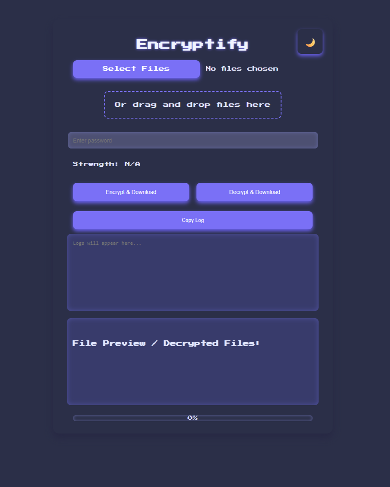
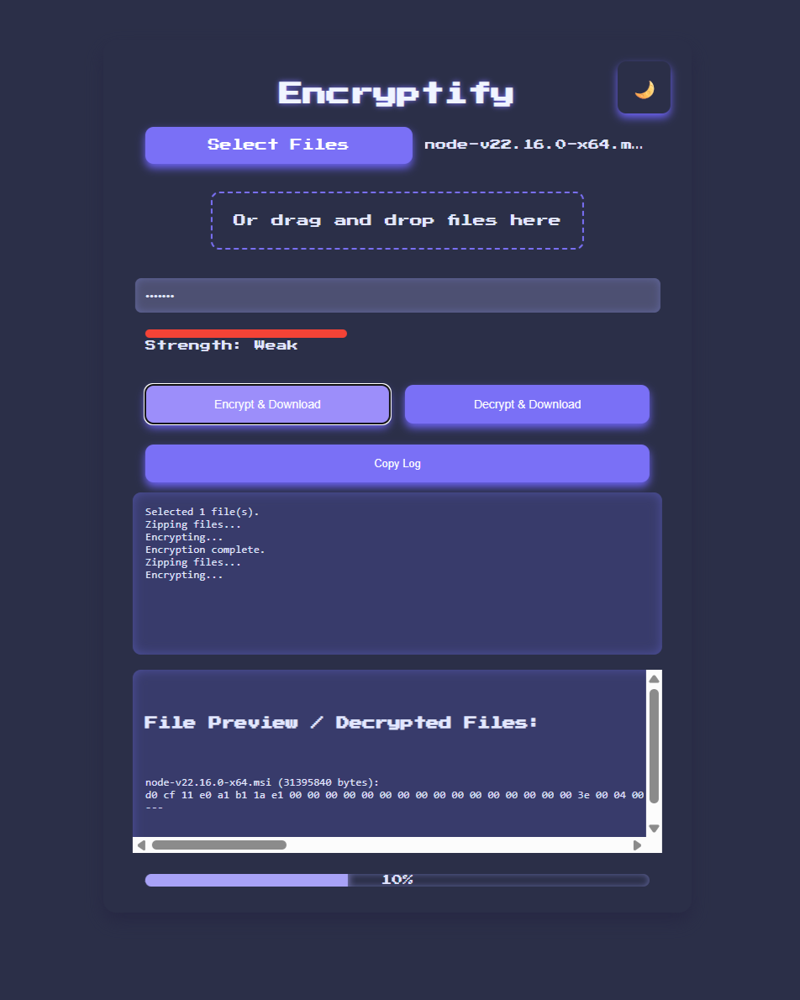
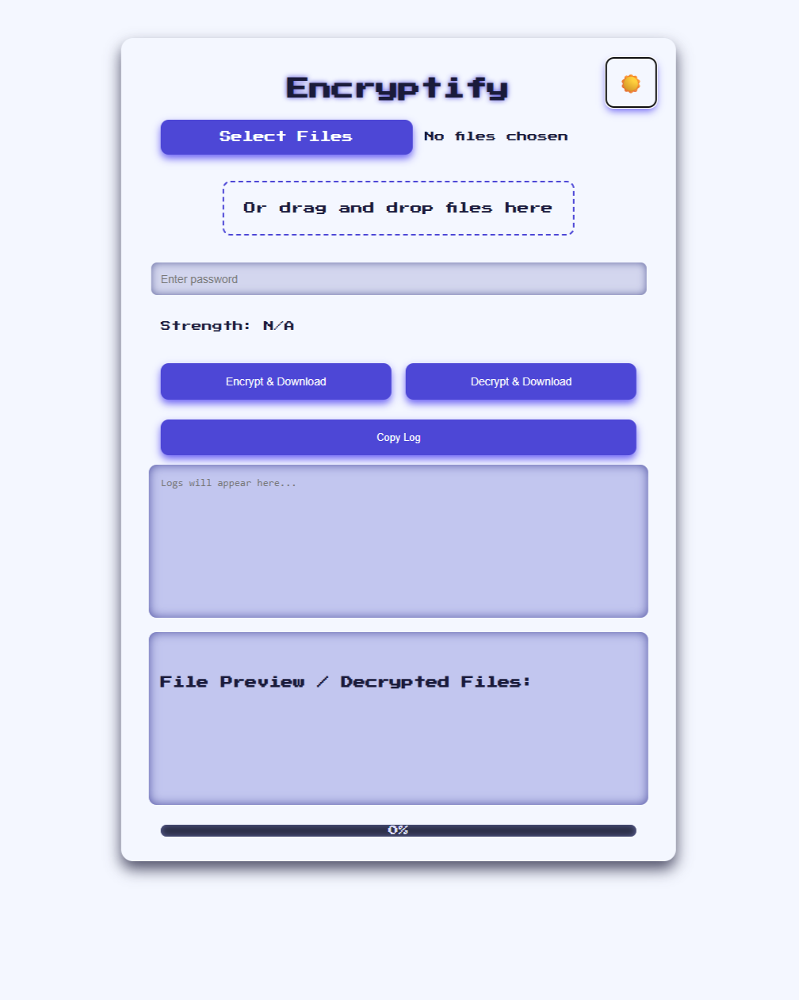

# Encryptify
A Secure File Encryption Desktop App

# 🔐 Encryptify

**Encryptify** is a stylish, portable file encryption tool with a retro game-inspired interface. It lets you encrypt, compress, and safely store any file with modern web cryptography — all from your desktop.

> 🎮 The UI is inspired by *Celeste*, one of my favorite games.

---

## ✨ Features

- 🔒 **AES-GCM 256-bit encryption** with PBKDF2 (SHA-512)
- 📁 **Drag & Drop or File Picker** support
- 📦 **Automatic Compression** before encryption (zipped using JSZip)
- ✅ **Checksum Verification** using SHA-512 on decryption
- 🧠 **Password Strength Meter** with visual feedback
- 🌓 **Dark/Light Mode Toggle** with retro styling
- 📋 **Clipboard copy** and download-ready logs
- 🖼️ **Preview Decrypted Files**
- 💾 **Portable & Offline** — runs from USB or folder
- 💻 **Windows available now**, **macOS** and **Linux** coming soon!

---

## 🖼️ Screenshots

### 🌙 Dark Mode (Default)

### 🔐 Encryption Progress & Logs

### ☀️ Light Mode

---

## 💻 Desktop Application

Currently available for:
- ✅ **Windows** (.exe, portable)
- ⏳ **macOS & Linux coming soon**

All builds are designed to be **portable** — no installation required. Just run from a folder or USB drive.

---

## 📄 License
🆓 Encryptify is **free software** for **educational and personal use only**.

- ✅ You may **share**, **modify**, and **distribute** it freely.
- ❌ You may **not sell**, license, or use it for commercial purposes.

## 🤝 Contributing
Pull requests are welcome! Feel free to:
- Report bugs
- Suggest new features
- Submit UI or UX improvements

## 🌐 Links
- [🔗 GitHub Repo](https://github.com/RatebBallouk/encryptify)
- [📦 Download Encryptify for Windows](https://github.com/RatebBallouk/encryptify/releases)

---

**Built with ❤️ and inspired by pixel-perfect design in *Celeste*.**
